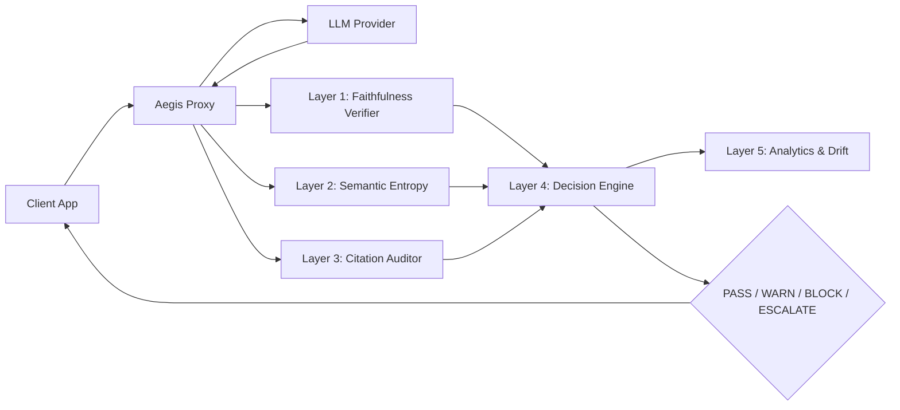

# Aegis

**Real-Time Hallucination Detection & Containment Firewall for LLM Applications**

By [Gautham Yerramareddy](https://ultrathink.in)

---

Hallucination-related incidents cause **$250M+ in annual enterprise losses**. LLMs deliver false information with the same confidence as accurate information. Aegis is a lightweight, self-hosted middleware that detects and blocks hallucinations in real-time before they reach end users.

## How It Works

Aegis is a FastAPI-based reverse proxy that sits between your LLM-powered application and end users. Every LLM response passes through a **5-layer verification pipeline** before delivery. Zero changes to your existing application required.



### The 5 Layers

| Layer | What It Does | How |
|-------|-------------|-----|
| **Faithfulness Verifier** | Decomposes responses into atomic claims and checks each against provided context | Embedding similarity + LLM judge |
| **Semantic Entropy Detector** | Generates multiple responses to the same prompt and measures consistency | Agglomerative clustering + Shannon entropy |
| **Citation Auditor** | Validates URLs, references, and checks if cited sources support the claims | HTTP verification + content similarity |
| **Decision Engine** | Combines layer scores into a composite score with domain-specific thresholds | Weighted scoring + configurable rules |
| **Analytics & Drift** | Tracks hallucination rate trends and detects statistical anomalies | Grubbs' Test + rolling z-scores |

## Quick Start

```bash
# Clone
git clone https://github.com/gauthamhk/aegis.git
cd aegis

# Configure
cp .env.example .env
# Add your API keys to .env

# Run with Docker
docker-compose up -d

# Or run locally
pip install -r requirements.txt
uvicorn src.main:app --host 0.0.0.0 --port 8000
```

## API Examples

### Verify an LLM Response

```bash
curl -X POST http://localhost:8000/v1/verify \
  -H "Content-Type: application/json" \
  -d '{
    "response_text": "Python was created by Guido van Rossum in 1991.",
    "context": "Python is a programming language created by Guido van Rossum, first released in 1991.",
    "prompt": "Who created Python?",
    "domain": "general"
  }'
```

### Proxy Mode (Aegis calls LLM + verifies)

```bash
curl -X POST http://localhost:8000/v1/proxy \
  -H "Content-Type: application/json" \
  -d '{
    "prompt": "Explain quantum computing",
    "provider": "gemini",
    "context": "Your reference documents here...",
    "domain": "general"
  }'
```

### Response Format

```json
{
  "action": "WARN",
  "composite_score": 0.62,
  "explanation": "Faithfulness: 0.60 (3/5 claims supported) | Semantic entropy: 0.80 (risk: medium) | Composite score: 0.62. Action: WARN",
  "faithfulness": { "score": 0.6, "supported_claims": 3, "total_claims": 5 },
  "entropy": { "entropy": 0.8, "risk_level": "medium" },
  "response_text": "Original response...",
  "modified_response": "Original response...\n\n---\n⚠️ **Aegis Warning**: This response contains potentially unsupported claims."
}
```

## Domain Configuration

Aegis supports domain-specific thresholds. Medical and legal domains enforce stricter verification:

```yaml
# config/domains/medical.yaml
domain: medical
faithfulness_threshold: 0.9
entropy_threshold: 0.3
citation_required: true
action_on_uncertain: ESCALATE
```

Available domains: `general`, `medical`, `legal`. Add custom domains by creating new YAML files in `config/domains/`.

## Performance

| Metric | Target | Notes |
|--------|--------|-------|
| Fast path latency | <500ms | Layers 1 + 4 only |
| Full path latency | <3s | All layers including entropy |
| Memory usage | <1.5GB | Embedding model ~200MB |
| Concurrency | 50+ | Simultaneous verifications |

## Monitoring

Aegis exposes Prometheus metrics at `/v1/metrics` and includes a Grafana dashboard. The built-in web dashboard provides real-time stats at `dashboard-ui/index.html`.

```bash
# View metrics
curl http://localhost:8000/v1/metrics

# Analytics summary
curl http://localhost:8000/v1/analytics/summary

# Drift detection events
curl http://localhost:8000/v1/analytics/drift
```

## Comparison to Alternatives

| Feature | Aegis | Galileo | Patronus |
|---------|-------|---------|----------|
| Self-hosted | Yes | No (SaaS) | No (SaaS) |
| Cost | Free | $$$ | $$$ |
| Statistical rigor | Grubbs' Test, entropy | Proprietary | Proprietary |
| Real-time | Yes (<500ms fast path) | Near real-time | Batch |
| Domain configs | YAML-based | Dashboard | Dashboard |
| Open source | Yes | No | No |

## Tech Stack

- **Runtime**: Python 3.11+, FastAPI, uvicorn
- **Database**: SQLite (aiosqlite)
- **Cache**: Redis
- **Embeddings**: sentence-transformers (all-MiniLM-L6-v2, runs locally)
- **LLM APIs**: Google Gemini, Groq, Kimi 2.5 (all free tiers)
- **Statistics**: NumPy, SciPy
- **Monitoring**: Prometheus + Grafana
- **Container**: Docker + docker-compose

## License

MIT
